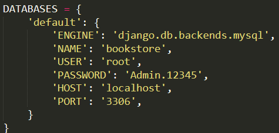
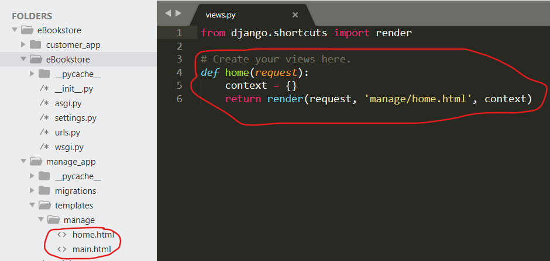
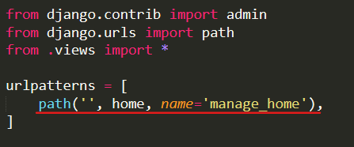

# eBookstore

## Clone project
```
git clone https://github.com/binh234/eBookstore.git

cd  eBookstore/eBookstore
```

## Cài đặt Anaconda
> Tải và cài đặt Anoconda tại đây: [Anaconda installation](https://docs.anaconda.com/anaconda/install/)

### Tạo và sử dụng môi trường ảo python với conda
```
conda create --name <env_name> python=3.8

activate <env_name>
```
> Thay <env_name> bằng tên môi trường cần tạo  
> **Lưu ý**: Để đảm bảo project hoạt động tốt, sử dụng lệnh *activate* để kích hoạt môi trường ảo trước khi thực hiện các lệnh bên dưới

## Cài đặt các thư viện cần thiết
```
pip install -r requirements.txt
```

## Chuẩn bị MySQL
> Đảm bảo có một schema tên **bookstore** với user là **root** và password là **Admin.12345**


## Migrate data vào MySQL
```
python manage.py migrate
```

## Nạp dữ liệu vào database
```
python manage.py loaddata db.json
```

## Phân quyền cho nhóm người dùng
> Chạy file **grant_role.sql** trong MySQL để tạo và phân quyền cho các nhóm người dùng

### Phát triển ứng dụng cho khách hàng
```
cd eBookstore/customer

python manage.py runserver
```
Mở [localhost:8000](http://localhost:8000).

### Phát triển ứng dụng cho nhân viên
```
cd eBookstore/staff

python manage.py runserver
```
Mở [localhost:8000](http://localhost:8000).

### Thêm 1 template mới vào project
* Thêm file **.html** vào thư mục <app_name>/template/<app_name>
* Thêm một view function mới vào file <app_name>/view_funnc.py

* Thêm url mới vào file <app_name>/urls.py theo cấu trúc path('<url_path>', view_func, name='<url_name>')


### Thêm file static (css, js, image, ...) vào project
* Thêm file *.(css/js/...)* vào thư mục *static/(css/js/...)*

### Liên kết css, js, ... vào file html
* Thêm dòng **** vào file html tương ứng
* Liên kết css, js, ... vào file html  
*Ex:* 
```html
<link rel="stylesheet" href="">
```
